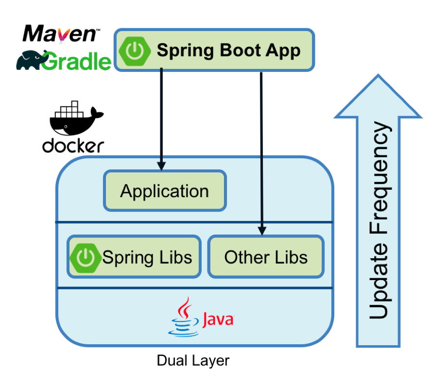

# Prerequisite

Before we will start the exercise you will need to go to IBM Cloud Shell to get ready to use environment : https://workshop.shell.cloud.ibm.com/
You will have to login with your IBM Cloud user and then use the password : ikslab


1) Select the account with the openshift cluster.
2) Start the terminal.

# Exercise 1: Deploying your first Springboot app

Copy git repo:
```
$ git clone https://github.com/tal2k4xj/docker-springboot.git	
```

Change directory:
```
$ cd docker-springboot/springdemo
```

Run Springboot application:
```
$ mvn spring-boot:run
```

Go to port 8080 and add /api/hello to see our application running:
*(https://p8080-user-ibmid-<somerandomid>.workshop.us-south.shell.cloud.ibm.com/api/hello)*


# Exercise 2: Build & Run docker springboot

Before we build the dockerfile we need to package the application to jar file:
```
$ mvn clean -Dmaven.test.skip package 
or
$ ./mvnw install
```

Create a Dockerfile:
```
$ nano Dockerfile
```

Copy & paste:
```
FROM openjdk:8-jdk-alpine
ARG REVISION
COPY target/demo-${REVISION}-SNAPSHOT.jar app.jar
ENTRYPOINT ["java","-Djava.security.egd=file:/dev/./urandom","-jar","/app.jar"]
```

** To exit "nano" editor press: ctrl+x -> Y -> Enter.

Build the image:
```
$ docker build --build-arg REVISION=0.0.1 -t hello-springboot:1.0 .
```

Run the application:
```
docker run -d -p 8080:8080 hello-springboot:1.0
```

Check that the docker is running:
```
$ docker ps
```

You suppose to get this:
```
CONTAINER ID        IMAGE                  COMMAND                  CREATED             STATUS              PORTS                    NAMES
4b51950322c4        hello-springboot:1.0   "java -Djava.securit…"   5 seconds ago       Up 4 seconds        0.0.0.0:8080->8080/tcp   dreamy_mclean
```

Go to port 8080 again and add /api/hello to see our application running:
*(https://p8080-user-ibmid-<somerandomid>.workshop.us-south.shell.cloud.ibm.com/api/hello)*


*** NOTE - If you get any errors like "no port connected" try to use this command: ***
```
$ export MAVEN_OPTS="-XX:+UseSerialGC -Xss512k -XX:MaxRAM=200m"
```
And repeat the exercise.

# Exercise 3: How to build better images using layers

First lets understand layers in docker image, to see the layers we need to IMAGE ID:
```
$ docker ps
```

Now copy the IMAGE ID of `hello-springboot` and do the following command:
```
$ docker history <IMAGE-ID>
```

You should get the following:
```
IMAGE               CREATED             CREATED BY                                      SIZE                COMMENT
1b0e6b17bc66        2 hours ago         /bin/sh -c #(nop)  ENTRYPOINT ["java" "-Djav…   0B                  
a6818bed45f5        2 hours ago         /bin/sh -c #(nop) COPY file:0a763dac3342ead3…   17.6MB              
a81c70a40088        2 hours ago         /bin/sh -c #(nop)  ARG REVISION                 0B                  
a3562aa0b991        8 months ago        /bin/sh -c set -x  && apk add --no-cache   o…   99.3MB              
<missing>           8 months ago        /bin/sh -c #(nop)  ENV JAVA_ALPINE_VERSION=8…   0B                  
<missing>           8 months ago        /bin/sh -c #(nop)  ENV JAVA_VERSION=8u212       0B                  
<missing>           8 months ago        /bin/sh -c #(nop)  ENV PATH=/usr/local/sbin:…   0B                  
<missing>           8 months ago        /bin/sh -c #(nop)  ENV JAVA_HOME=/usr/lib/jv…   0B                  
<missing>           8 months ago        /bin/sh -c {   echo '#!/bin/sh';   echo 'set…   87B                 
<missing>           8 months ago        /bin/sh -c #(nop)  ENV LANG=C.UTF-8             0B                  
<missing>           8 months ago        /bin/sh -c #(nop)  CMD ["/bin/sh"]              0B                  
<missing>           8 months ago        /bin/sh -c #(nop) ADD file:a86aea1f3a7d68f6a…   5.53MB
```
First we can tell that the size of our base image is more than 100MB, also we can see that we added 3 layers on top of it in the size of 17.6MB.

This is the single layer approach where we take base image and just copy the JAR file to it and run the container.


This is a great approach for small applications, but if we will look on bigger applications we will get up to few GB which can cause us to spend alot of time whilre rebuilding the docker images everytime we change the code or dependencies.
Most of the time we usualy rebuild our docker images when the code changes and we dont want to fetch our dependencies all the time we change the code, to do that we will change our Dockerfile approach to a dual layer approach.

To understand how to do that we can just do the following example.

A Spring Boot fat jar naturally has "layers" because of the way that the jar itself is packaged. If we unpack it first it will already be divided into external and internal dependencies. To do this in one step in the docker build, we need to unpack the jar first:
```
$ mkdir target/dependency
$ cd target/dependency
$ jar xf ../demo-0.0.1-SNAPSHOT.jar
$ cd ~/docker-springboot/springdemo/
```

Now remove our old Dockerfile:
```
$ rm Dockerfile
```

Create new Dockerfile:
```
$ nano Dockerfile
```

And paste the following example:

```dockerfile
FROM openjdk:8-jdk-alpine
VOLUME /tmp
ARG DEPENDENCY=target/dependency
COPY ${DEPENDENCY}/BOOT-INF/lib /app/lib
COPY ${DEPENDENCY}/META-INF /app/META-INF
COPY ${DEPENDENCY}/BOOT-INF/classes /app
ENTRYPOINT ["java","-cp","app:app/lib/*","com.example.demo.DemoApplication"]
```

Now build new image with the new dockerfile:
```
$ docker build -t hello-springboot:2.0 .
```

And run the new image:
```
$ docker run -d -p 8080:8080 hello-springboot:2.0
```

Now copy the IMAGE ID of `hello-springboot` and do the following command:
```
$ docker history <IMAGE-ID>
```

Now take a look at the addition layers that you just added by building the multi layer docker file:
```
IMAGE               CREATED              CREATED BY                                      SIZE                COMMENT
5da74f509ae0        About a minute ago   /bin/sh -c #(nop)  ENTRYPOINT ["java" "-cp" …   0B                  
eefc29c2c9b5        About a minute ago   /bin/sh -c #(nop) COPY dir:a8d06fea70dbb72e9…   1.56kB              
a0c37335698c        About a minute ago   /bin/sh -c #(nop) COPY dir:60040a004074f4812…   1.81kB              
ce77f313f4a7        About a minute ago   /bin/sh -c #(nop) COPY dir:127f2f5e57810b32d…   17.5MB              
70fbb718f3b8        About a minute ago   /bin/sh -c #(nop)  ARG DEPENDENCY=target/dep…   0B                  
655e4910513a        About a minute ago   /bin/sh -c #(nop)  VOLUME [/tmp]                0B                  
a3562aa0b991        8 months ago         /bin/sh -c set -x  && apk add --no-cache   o…   99.3MB              
<missing>           8 months ago         /bin/sh -c #(nop)  ENV JAVA_ALPINE_VERSION=8…   0B                  
<missing>           8 months ago         /bin/sh -c #(nop)  ENV JAVA_VERSION=8u212       0B                  
<missing>           8 months ago         /bin/sh -c #(nop)  ENV PATH=/usr/local/sbin:…   0B                  
<missing>           8 months ago         /bin/sh -c #(nop)  ENV JAVA_HOME=/usr/lib/jv…   0B                  
<missing>           8 months ago         /bin/sh -c {   echo '#!/bin/sh';   echo 'set…   87B                 
<missing>           8 months ago         /bin/sh -c #(nop)  ENV LANG=C.UTF-8             0B                  
<missing>           8 months ago         /bin/sh -c #(nop)  CMD ["/bin/sh"]              0B                  
<missing>           8 months ago         /bin/sh -c #(nop) ADD file:a86aea1f3a7d68f6a…   5.53MB
```



# Exercise 4: Build multi stage Dockerfile

Now that we understand how to use Dockerfile more efficiently we can add another complexity with multi-stage.
Lets have a look at the following example.

As we did remove our Dockerfile again:
```
$ rm Dockerfile
```

Create new Dockerfile:
```
$ nano Dockerfile
```

Copy & paste the dockerfile below:
```dockerfile
FROM openjdk:8-jdk-alpine as build
WORKDIR /workspace/app

COPY mvnw .
COPY .mvn .mvn
COPY pom.xml .
COPY src src

RUN ./mvnw install -DskipTests
RUN mkdir -p target/dependency && (cd target/dependency; jar -xf ../*.jar)

FROM openjdk:8-jdk-alpine
VOLUME /tmp
ARG DEPENDENCY=/workspace/app/target/dependency
COPY --from=build ${DEPENDENCY}/BOOT-INF/lib /app/lib
COPY --from=build ${DEPENDENCY}/META-INF /app/META-INF
COPY --from=build ${DEPENDENCY}/BOOT-INF/classes /app
ENTRYPOINT ["java","-cp","app:app/lib/*","com.example.demo.DemoApplication"]
```

Now build the new image again with the new dockerfile:
```
$ docker build -t hello-springboot:3.0 .
```

And run the new image:
```
$ docker run -d -p 8080:8080 hello-springboot:3.0
```

Now we also able to do the mvn build everywhere even if we dont have the mvn installed.

# Exercise 5: Springboot with mysql

Run docker with sql:
```
$ docker run --name mysqldb -e MYSQL_ROOT_PASSWORD=root -e MYSQL_DATABASE=bootdb -d mysql:8
```

Get inside the sql docker and check the environment:
```
$ docker exec -it mysqldb bash; 

$ mysql -u root -p
Password : root

$ show databases;
```

Run the springboot application that will connect to mysql:
```
$ git clone https://github.com/tal2k4xj/docker-springboot.git

$ cd docker-springboot/employee-jdbc/

$ mvn clean package -DskipTests

$ docker build -t employee-jdbc .

$ docker run --name employee-jdbc-container -p 8080:8080 -d employee-jdbc
```

# References
https://openliberty.io/blog/2018/07/02/creating-dual-layer-docker-images-for-spring-boot-apps.html

https://spring.io/guides/gs/spring-boot-docker/

https://www.javainuse.com/devOps/docker/docker-mysql


